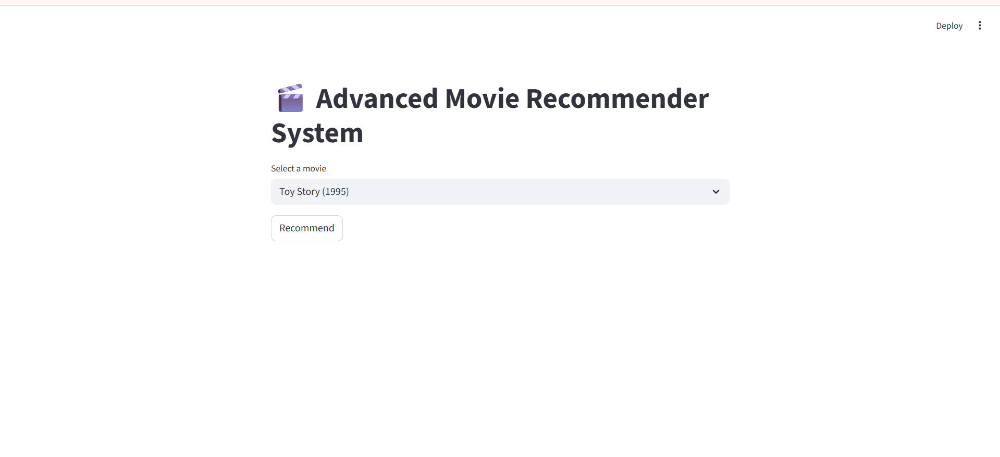
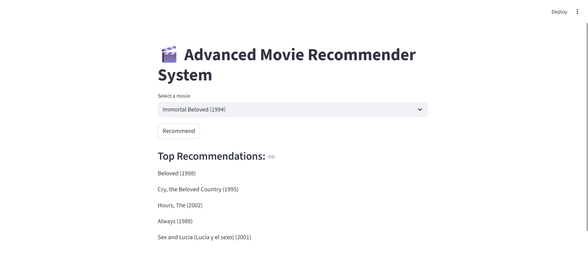

# 🎬 Advanced Movie Recommender System

> 🚀 A production-style hybrid recommendation system combining Machine Learning techniques to deliver personalized movie suggestions.

---

## 📸 Demo

### 🖥️ Application Interface

### 📊 Recommendation Output

---

## 🚀 Project Overview

This project builds a **hybrid movie recommendation system** that leverages both:

- 🎯 **Content-Based Filtering** (movie features)
- 🤝 **Collaborative Filtering** (user behavior)

to generate **high-quality, personalized recommendations**.

Unlike basic recommenders, this system combines multiple techniques into a **single intelligent pipeline**, improving accuracy and real-world usability.

---

## 🧠 Core Idea

Most recommendation systems rely on a single method.

👉 This project solves that limitation by using a **Hybrid Model**:

Final Score = **0.6 × Content Score + 0.4 × Collaborative Score**

✔ Better recommendations  
✔ More realistic system design  
✔ Industry-relevant approach  

---

## ⚙️ System Architecture

### 🔹 Content-Based Filtering
- Feature extraction from movie metadata (genres)
- Text vectorization using **TF-IDF**
- Similarity calculation using **Cosine Similarity**

---

### 🔹 Collaborative Filtering
- Uses user-movie interaction data
- Builds similarity between movies/users
- Captures behavioral patterns

---

### 🔹 Hybrid Recommendation Engine
- Combines both models using weighted scoring
- Handles missing data safely
- Produces Top-N recommendations

---

## 🎯 Key Features

✔ Hybrid Recommendation System (Content + Collaborative)  
✔ Real-time predictions using Streamlit UI  
✔ Robust handling of missing similarity values  
✔ Clean and interactive user interface  
✔ Scalable design for real-world applications  

---

## 🛠️ Tech Stack

- Python  
- Pandas  
- NumPy  
- Scikit-learn  
- Streamlit  

---

## 📂 Project Structure

advanced-movie-recommender-system/
│
├── app.py # Streamlit application
├── movies.pkl # Movie metadata
├── requirements.txt # Dependencies
├── README.md # Project documentation
├── ui.png # UI screenshot
└── output.png # Output screenshot

---

## 💼 Business Impact

- 🎯 Enhances user engagement through personalization  
- 📈 Improves recommendation accuracy using hybrid modeling  
- 💡 Demonstrates real-world ML system design  
- 🧠 Useful for platforms like Netflix, Amazon, Spotify  

---

## 🔥 Why This Project Stands Out

✔ Not a basic recommender — uses **Hybrid ML approach**  
✔ Includes **end-to-end pipeline (data → model → UI)**  
✔ Built with **real-world thinking, not just theory**  
✔ Demonstrates both **ML + Product mindset**

---

## 👨‍💻 Author

**MANNETI YESWANTH REDDY**  
Data Science | Machine Learning | Python  

---

## ⭐ Support

If you found this useful, consider giving it a ⭐ on GitHub!
